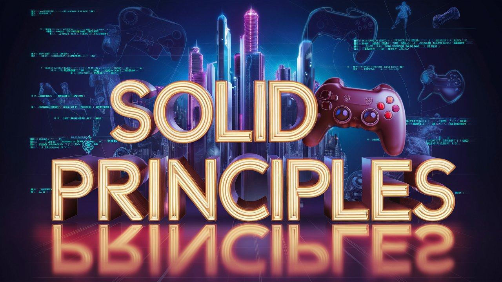

  

# SOLID-Principles demo game
A demo showcase game that simply presents the S.O.L.I.D principles in Unity 3D using C#.

## S.O.L.I.D Principles
- Single Responsibility Principle: A class should have one, and only one, reason to change.
- Open Closed Principle: Modify behavior by extending, not modifying code.
- Liskov Substitution Principle: Subtypes must be substitutable for their base.
- Interface Segregation Principle: Clients should not depend on interfaces they don't use.
- Dependency Inversion Principle: Depend on abstractions, not concrete implementations.

## Demo Showcase Game Video
